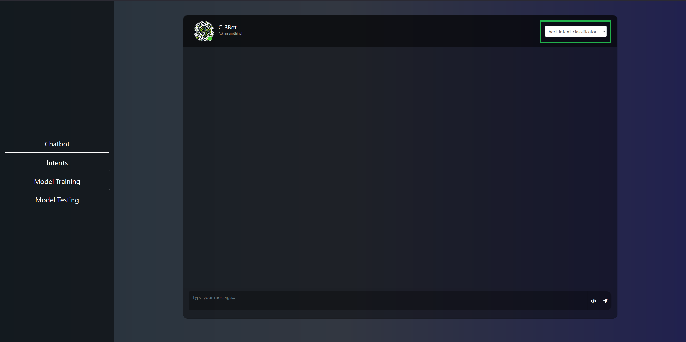
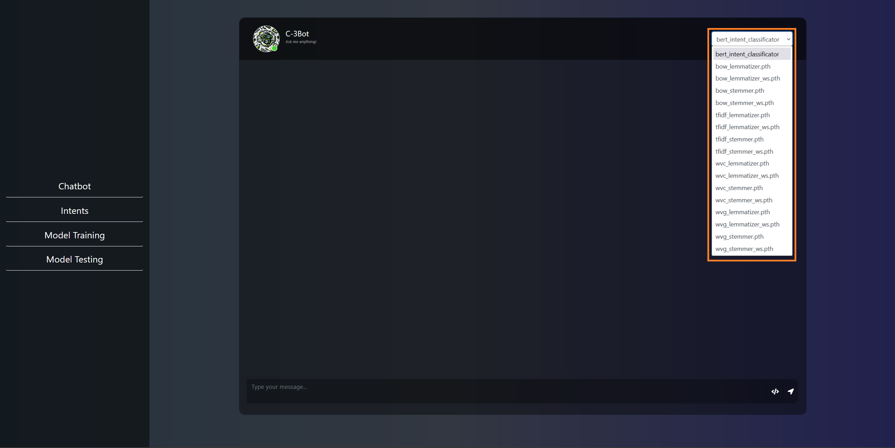
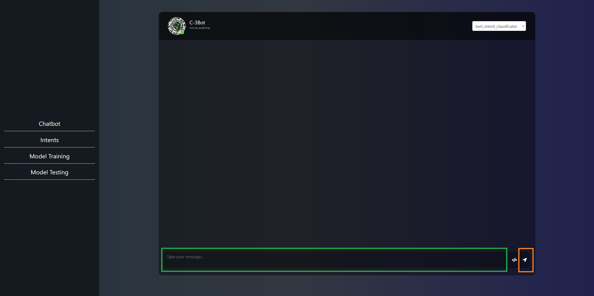
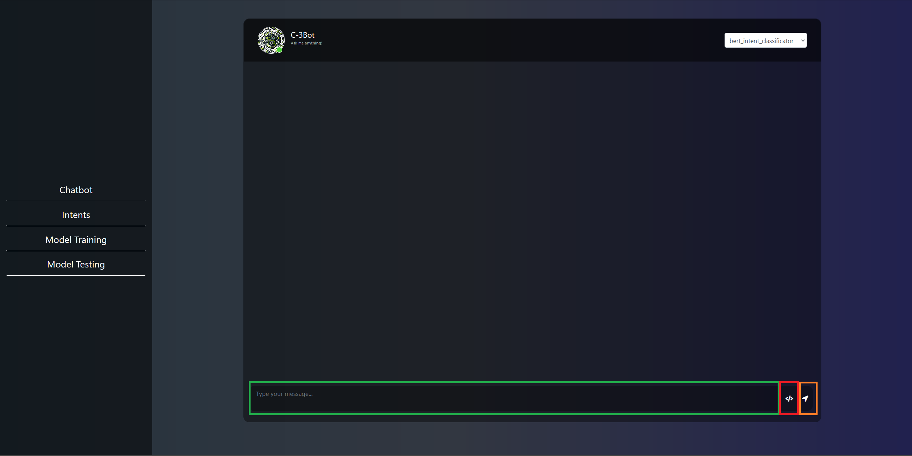
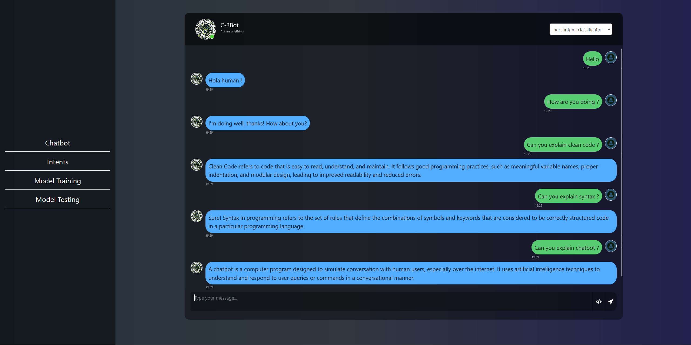
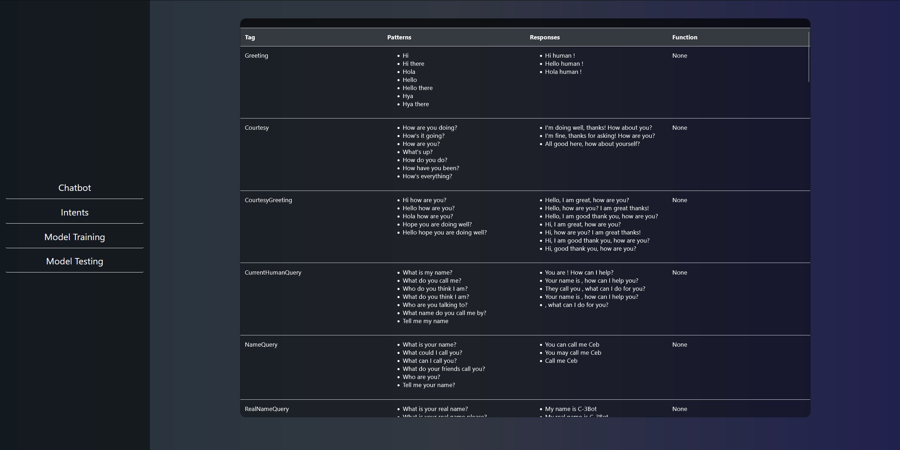
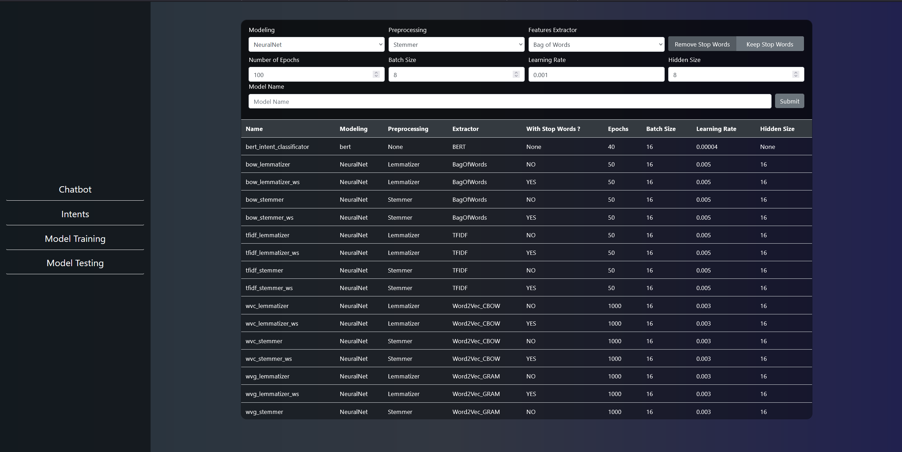
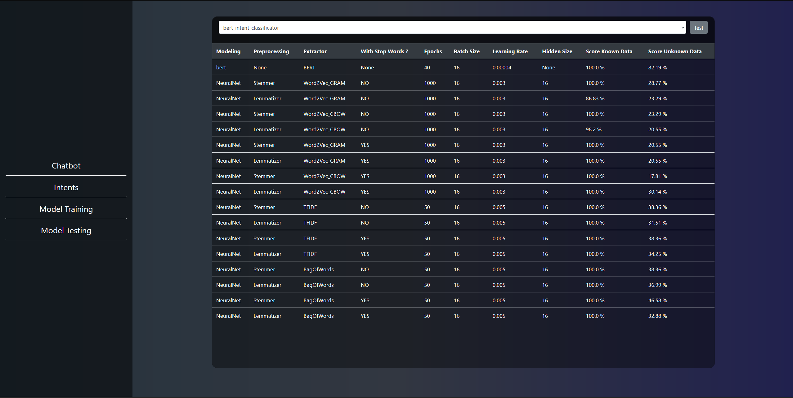

# C-3Bot

## Table of Contents
- [Description](#description)
- [Installation](#installation)
- [Python Version](#python-version)
- [Usage For Classic User](#usage-for-classic-user)
  - [Changing the Chatbot Model](#changing-the-chatbot-model)
  - [Running the Application](#running-the-application)
  - [Simple interaction with the Chatbot](#interacting-with-the-chatbot)
  - [Viewing the Results](#viewing-the-results)
    - [Simple Results](#simple-results)
    - [Code analysis Results](#code-analysis-results)
- [Usage For the Tester and Developper](#usage-for-the-tester-and-developper)
  - [Intent](#intent)
  - [Model Training](#model-training)
  - [Model Testing](#model-testing)

## Description

A Chatbot Prototype for Code Refinement and AI Assistance

## Installation

To install the required packages, run the following command when inside the `src` folder:

```bash
pip install -r requirements.txt
```

## Python Version

This project requires Python 3.12.1. You can download the latest version of Python from the [official website](https://www.python.org/downloads/).

## Usage For Classic User

### Running the Application

To start the application, navigate to the project `src` directory and run the following command:

```bash
python main.py
```

### Changing the Chatbot Model

To change the type of model used by the chatbot, simply click on the drop-down menu in red and choose one of the options in orange.

<div align="center">
    
    
</div>

### Simple interaction with the Chatbot

1. Once the application is running, open your web browser and go to `http://127.0.0.1:5000`.
2. Type your query into the input box in green and press the send button in orange.

<div align="center">
    
</div>

### Sending code to the Chatbot

1. Once the application is running, open your web browser and go to `http://127.0.0.1:5000`.
2. Type your query into the input box in green.
3. Press the code button in red.
4. Type the langage your are using next to the first ` ``` ` that can be `java` OR `python` OR `c`
5. Paste your code between the ` ``` ` Like the example bellow
```
    ```python
    clas Student:
        def __init__(self, name='', roll=0, marks=0.0:
            self.name = name
            self.roll = roll
            self.marks = marks

    de main():
        s = Student()

        print("Enter information:")
        s.name = input("Enter name: )

        s.roll = int(input("Enter roll number: "))
        s.marks = float(input("Enter marks: "))

        print("\nDisplaying Information:")
        print(f"Name: {s.name}")
        print(f"Roll number: {s.roll}")
        print(f"Marks: {s.marks:.1f}")

    if __name__ == '__main__':
        main()
    ```

```
6. Press the send button in orange. 

<div align="center">
    
</div>

### Viewing the Results

#### Simple Results

1. The chatbot will process your input and display the response in the frame above the input box.
2. The response will be based on the intent recognized from your input.

<div align="center">
    
</div>

#### Code analysis Results
1. The chatbot will process your input and display the response below the input box.
2. The response will be based on the intent recognized from your input.

<div align="center">
    
    
</div>

## Usage For the Tester and Developper

### Intent

Allow people to see all the intent in the file `intents.json`

<div align="center">
    
</div>

### Model Training

Allow people to train there own model with different parameter

<div align="center">
    
</div>

### Model Testing

Allow people to test any model to see how they perform

<div align="center">
    
</div>

---